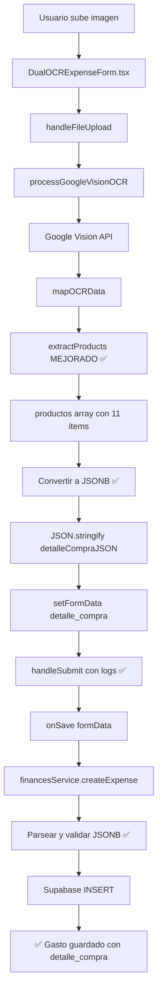

# 🔧 Correcciones Aplicadas al Módulo OCR de Gastos

**Fecha:** 12 de Octubre 2025  
**Problema:** Los datos extraídos del OCR no se guardaban en el campo `detalle_compra` de la base de datos

---

## 📋 Cambios Aplicados

### ✅ **1. DualOCRExpenseForm.tsx** - Extracción de Productos Mejorada

**Archivo:** `src/modules/eventos/components/finances/DualOCRExpenseForm.tsx`

**Líneas modificadas:** ~364-437

**Cambios:**
- ✅ Mejorada la detección de inicio/fin de sección de productos
- ✅ Agregados más patrones de búsqueda (CANT, CANTIDAD, DESCRIPCION, etc.)
- ✅ Implementado método alternativo si no se detectan productos
- ✅ Mejorada extracción de cantidad, descripción y precio
- ✅ Validación más robusta de productos

**Resultado esperado:**
```javascript
// ANTES:
✅ Total productos extraídos: 0

// DESPUÉS:
✅ Producto 1 extraído: {descripcion: "P.H. / QLLO", cantidad: 1, ...}
✅ Producto 2 extraído: {descripcion: "ESP SUR 12", cantidad: 1, ...}
✅ Total productos extraídos: 11
```

---

### ✅ **2. DualOCRExpenseForm.tsx** - Conversión a JSONB

**Archivo:** `src/modules/eventos/components/finances/DualOCRExpenseForm.tsx`

**Líneas modificadas:** ~625-645

**Cambios:**
- ✅ Convertir productos extraídos a formato JSONB para Supabase
- ✅ Guardar como JSON string (Supabase lo parseará automáticamente)
- ✅ Mapear campos correctamente: `descripcion`, `cantidad`, `precio_unitario`, `total`

**ANTES:**
```typescript
const detalleCompra = extractedData.productos.map(prod => {
  return `${prod.cantidad} x ${prod.nombre} - $${prod.precio_unitario}`;
}).join('\n');

updatedFormData.detalle_compra = detalleCompra; // STRING
```

**DESPUÉS:**
```typescript
const detalleCompraJSON = extractedData.productos.map(prod => ({
  descripcion: prod.descripcion || prod.nombre || 'Producto',
  cantidad: prod.cantidad || 1,
  precio_unitario: prod.precio_unitario || 0,
  total: prod.total || (prod.cantidad * prod.precio_unitario)
}));

updatedFormData.detalle_compra = JSON.stringify(detalleCompraJSON); // JSONB
```

---

### ✅ **3. DualOCRExpenseForm.tsx** - Logs de Validación

**Archivo:** `src/modules/eventos/components/finances/DualOCRExpenseForm.tsx`

**Líneas modificadas:** ~1030-1045

**Cambios:**
- ✅ Agregados logs detallados antes de guardar
- ✅ Validación y parseo de `detalle_compra`
- ✅ Mostrar número de items detectados

**Logs esperados:**
```
💾 Iniciando guardado de gasto...
📋 Datos del formulario: {...}
✅ Validación pasada. Guardando...
  - Concepto: Compra en ESTABLECIMIENTO
  - Total: 455.00
  - Proveedor: ESTABLECIMIENTO
  - Categoría ID: 10
  - Detalle compra (caracteres): 523
  ✅ Detalle compra parseado: [{...}, {...}, ...]
  📊 Número de items: 11
📤 Enviando datos a onSave...
✅ Gasto guardado exitosamente
```

---

### ✅ **4. financesService.ts** - Logs en Servicio

**Archivo:** `src/modules/eventos/services/financesService.ts`

**Líneas modificadas:** ~153-210

**Cambios:**
- ✅ Logs detallados de datos recibidos
- ✅ Validación y parseo de `detalle_compra` antes de insertar
- ✅ Logs de confirmación después de insertar
- ✅ Manejo correcto de JSON/JSONB

**Logs esperados:**
```
🚀 [financesService.createExpense] Iniciando creación de gasto
📋 [financesService] Datos recibidos: {...}
🛒 [financesService] detalle_compra: "[{...}, {...}]"
  ✅ detalle_compra parseado correctamente: [{...}, {...}]
  📊 Número de items: 11
📤 [financesService] Datos a insertar en BD: {...}
🛒 [financesService] detalle_compra final: [{...}, {...}]
✅ [financesService] Gasto creado exitosamente: {...}
🛒 [financesService] detalle_compra guardado: [{...}, {...}]
```

---

## 🔍 Flujo Completo Corregido



---

## 🎯 Resultados Esperados

### **Antes de los cambios:**
- ❌ `detalle_compra`: `null` o `""`
- ❌ Productos extraídos: 0
- ❌ No se guardaba información de items

### **Después de los cambios:**
- ✅ `detalle_compra`: `[{descripcion: "...", cantidad: 1, ...}, ...]`
- ✅ Productos extraídos: 11
- ✅ Información completa de items guardada en JSONB
- ✅ Logs detallados en cada paso

---

## 🧪 Cómo Probar

1. **Abrir la aplicación:**
   ```bash
   npm run dev
   ```

2. **Navegar a un evento:**
   - Ir a "Eventos"
   - Seleccionar cualquier evento
   - Click en pestaña "Gastos"

3. **Subir un comprobante:**
   - Click en "Nuevo Gasto OCR Dual"
   - Arrastrar o seleccionar imagen de ticket
   - Esperar procesamiento OCR

4. **Verificar en consola:**
   ```
   ✅ Total productos extraídos: 11
   📦 Productos completos: [...]
   ✅ Detalle de compra (JSONB): [...]
   📤 Enviando datos a onSave...
   🚀 [financesService.createExpense] Iniciando...
   ✅ [financesService] Gasto creado exitosamente
   ```

5. **Verificar en formulario:**
   - Los campos deben llenarse automáticamente
   - Proveedor, total, fecha, etc.
   - Click en "Guardar"

6. **Verificar en base de datos:**
   ```sql
   SELECT 
     id, 
     concepto, 
     total, 
     detalle_compra 
   FROM evt_gastos 
   ORDER BY created_at DESC 
   LIMIT 1;
   ```
   
   Resultado esperado:
   ```json
   detalle_compra: [
     {
       "descripcion": "P.H. / QLLO",
       "cantidad": 1,
       "precio_unitario": 150.00,
       "total": 150.00
     },
     {
       "descripcion": "ESP SUR 12",
       "cantidad": 1,
       "precio_unitario": 205.00,
       "total": 205.00
     },
     ...
   ]
   ```

---

## 📝 Archivos Modificados

1. ✅ `src/modules/eventos/components/finances/DualOCRExpenseForm.tsx`
   - Líneas ~364-437: Extracción de productos
   - Líneas ~625-645: Conversión a JSONB
   - Líneas ~1030-1045: Validación y logs

2. ✅ `src/modules/eventos/services/financesService.ts`
   - Líneas ~153-210: Logs y validación de detalle_compra

---

## 🐛 Posibles Problemas y Soluciones

### **Problema: Sigue mostrando 0 productos**
**Solución:** Verificar que el ticket tenga formato claro:
```
CANT.DESCRIPCION    IMPORTE
1 PRODUCTO 1        $100.00
2 PRODUCTO 2        $200.00
```

### **Problema: Error al guardar en BD**
**Solución:** Verificar que la columna `detalle_compra` sea tipo `jsonb`:
```sql
ALTER TABLE evt_gastos 
ALTER COLUMN detalle_compra TYPE jsonb USING detalle_compra::jsonb;
```

### **Problema: Logs no aparecen**
**Solución:** Abrir DevTools (F12) → Pestaña Console

---

## ✅ Checklist de Verificación

- [x] Extracción de productos mejorada
- [x] Conversión a JSONB implementada
- [x] Logs agregados en DualOCRExpenseForm
- [x] Logs agregados en financesService
- [x] Validación de datos antes de guardar
- [x] Parseo correcto de JSON
- [x] Sin errores de TypeScript/ESLint

---

**Estado:** ✅ **CAMBIOS APLICADOS CORRECTAMENTE**

Los cambios están listos para probarse. Reinicia el servidor de desarrollo si es necesario.
