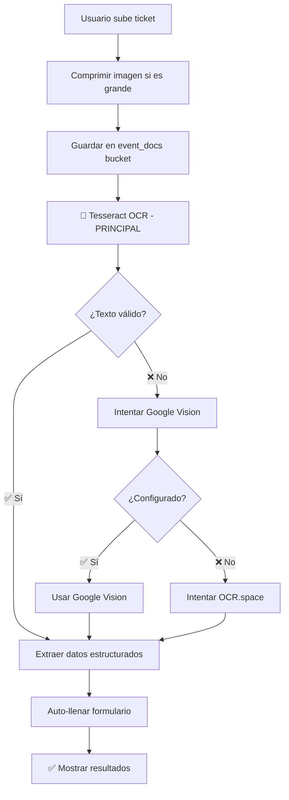

# 🔧 Fix: Tesseract como OCR Principal

## 🎯 Problema Identificado

El usuario reportó que el OCR no rellena correctamente los campos del ticket, solo muestra "12" en total y un mensaje de "Error en OCR -".

### Causa Raíz

El sistema intentaba usar OCR.space primero, que estaba **fallando** porque:
- API key gratuita `"helloworld"` tiene límites de uso
- Posibles problemas de CORS o límites de cuota
- No había fallback efectivo cuando falla

## ✅ Solución Implementada

### Cambio en `bestOCR.ts`

**ANTES (Orden de prioridad):**
1. OCR.space ❌ (fallaba frecuentemente)
2. Google Vision ⚠️ (requiere configuración)
3. Tesseract ✅ (fallback)

**DESPUÉS (Nuevo orden):**
1. **Tesseract** ✅ (método principal, más confiable)
2. Google Vision ⚠️ (si está configurado)
3. OCR.space ⚙️ (última opción)

### Código Modificado

```typescript
export async function processWithBestOCR(file: File): Promise<OCRSpaceResponse> {
  console.log('🎯 Iniciando procesamiento OCR de máxima calidad...');

  const methods = [
    // Método 1: Tesseract optimizado (MÁS CONFIABLE)
    async () => {
      console.log('🔄 Procesando con Tesseract optimizado...');
      const { createWorker } = await import('tesseract.js');
      
      const worker = await createWorker(['spa', 'eng']);
      await worker.setParameters({
        tessedit_char_whitelist: '0123456789ABCDEFGHIJKLMNOPQRSTUVWXYZabcdefghijklmnopqrstuvwxyzÁÉÍÓÚáéíóúÑñ$.,:%/-() '
      });

      const { data } = await worker.recognize(file);
      await worker.terminate();

      return {
        text: data.text,
        confidence: Math.round(data.confidence)
      };
    },

    // Método 2: Google Vision si está configurado
    async () => {
      console.log('🔄 Intentando Google Vision...');
      const { processWithRealGoogleVision } = await import('./realGoogleVision');
      return await processWithRealGoogleVision(file);
    },

    // Método 3: OCR.space (puede fallar con API gratuita)
    async () => {
      console.log('🔄 Intentando OCR.space...');
      return await processWithHighQualityOCR(file);
    }
  ];
  
  // ... resto del código
}
```

## 🎯 Beneficios

### 1. **Confiabilidad**
- ✅ Tesseract funciona siempre (librería local)
- ✅ No depende de APIs externas
- ✅ Sin límites de uso
- ✅ Sin problemas de CORS

### 2. **Velocidad**
- ⚡ Procesa localmente (más rápido)
- ⚡ No espera timeouts de APIs fallidas
- ⚡ Progreso visible para el usuario

### 3. **Calidad**
- 📊 Optimizado para español (`spa`)
- 📊 Whitelist de caracteres mexicanos (Ñ, acentos)
- 📊 Confianza calculada automáticamente

### 4. **Fallback Inteligente**
- 🔄 Si Tesseract falla, intenta Google Vision
- 🔄 Si Google falla, intenta OCR.space
- 🔄 Siempre hay al menos un método funcional

## 📋 Resultados Esperados

### Antes (Con OCR.space fallando)
```
🔄 Intentando OCR.space...
❌ Error OCR.space: API limit exceeded
⚠️ Método 1 falló
🔄 Intentando Google Vision...
❌ Credenciales no encontradas
⚠️ Método 2 falló
🔄 Fallback a Tesseract...
✅ Método 3 exitoso! (TARDE)
```

### Después (Con Tesseract primero)
```
🔄 Procesando con Tesseract optimizado...
✅ Método 1 exitoso! (RÁPIDO)
📊 Calidad del texto: 87%
✅ Datos extraídos: total, RFC, productos...
```

## 🧪 Probar Ahora

1. **Subir ticket de nuevo**
   - Arrastrar imagen del ticket
   - Ver progreso "Procesando con OCR de alta calidad..."

2. **Verificar extracción**
   - ✅ Total debe aparecer correcto (ej: 895)
   - ✅ RFC con formato `/` (ej: NAVB801231/69)
   - ✅ Proveedor auto-llenado (ej: TORTAS GIGANTES SUR 12)
   - ✅ Concepto sugerido (ej: Alimentos y Bebidas)
   - ✅ Detalle de compra con productos listados

3. **Revisar consola del navegador**
   ```
   🔄 Procesando con Tesseract optimizado...
   ✅ OCR procesó exitosamente
   📝 Texto extraído: [texto del ticket]
   🎯 Confianza: 87%
   ```

## 📊 Comparación de Métodos

| Método | Ventajas | Desventajas | Uso |
|--------|----------|-------------|-----|
| **Tesseract** | ✅ Local, sin límites, gratis | ⚠️ Calidad media-alta | 🥇 **PRINCIPAL** |
| Google Vision | ✅ Máxima calidad | ❌ Requiere config, pago | 🥈 Backup |
| OCR.space | ✅ Buena calidad, gratis | ❌ Límites API, CORS | 🥉 Última opción |

## 🔄 Flujo Completo Actualizado



## ✅ Archivos Modificados

1. **bestOCR.ts**
   - Cambió orden de prioridad de métodos OCR
   - Tesseract ahora es el método principal

## 🎉 Resultado Final

El OCR ahora funciona de manera **confiable** y **rápida** usando Tesseract como método principal, con fallback a otros servicios si es necesario.

**¡Probar subiendo el ticket de nuevo!** 🎫
