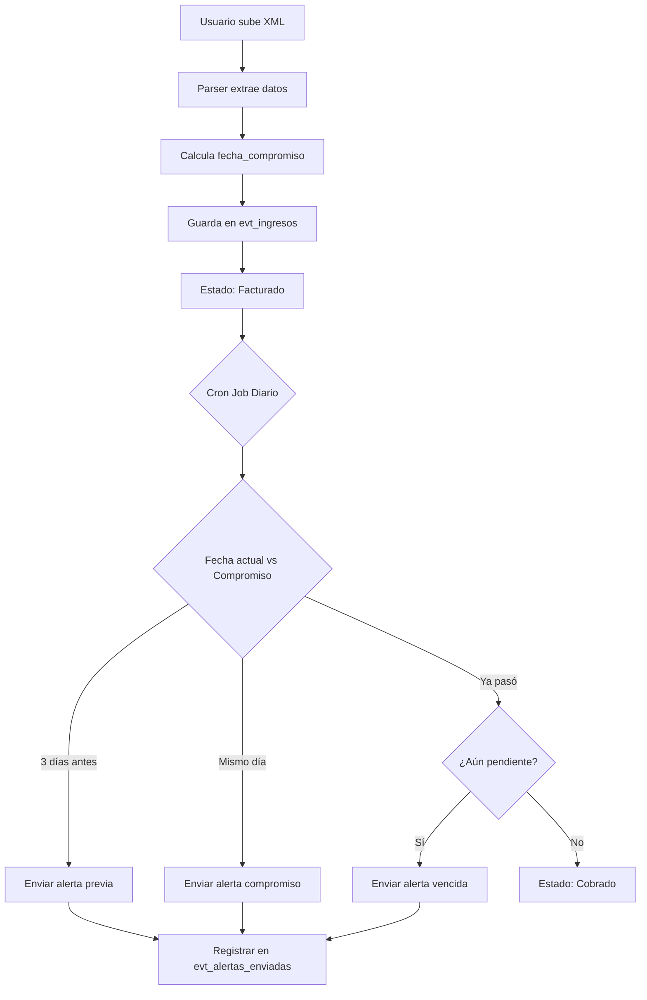

# 🎯 PLAN: Sistema de Gestión de Facturas Electrónicas (XML CFDI) con Seguimiento de Cobros

## 📋 Análisis del Sistema Actual

### ✅ Lo que ya existe:
1. **Parser de XML CFDI** (`cfdiXmlParser.ts`) - Extrae datos fiscales
2. **Módulo de Eventos** - Con filtros por año/mes
3. **Gestión de Ingresos** - Tabla `evt_ingresos` con campos fiscales
4. **Gestión de Clientes** - RFC, correos, datos fiscales
5. **Sistema de permisos y auditoría**

### 🆕 Lo que vamos a agregar:

## 1. 📊 Listado de Eventos Mejorado

**Ya existe** pero vamos a optimizarlo:
- ✅ Filtros por año/mes (ya implementado)
- ✅ Orden descendente (ya implementado)
- 🆕 Vista rápida de facturas pendientes de cobro
- 🆕 Indicadores visuales de estado de cobro

## 2. 📄 Módulo de Gestión de Facturas XML

### 2.1 Subida de Factura XML
**Campos a capturar automáticamente del XML:**
```typescript
interface FacturaXML {
  // Del XML CFDI
  uuid: string;              // UUID del timbre fiscal
  fecha_emision: Date;       // Fecha del XML
  rfc_emisor: string;        // RFC del emisor
  rfc_receptor: string;      // RFC del receptor  
  subtotal: number;
  iva: number;
  total: number;
  moneda: string;
  forma_pago: string;
  metodo_pago: string;
  uso_cfdi: string;
  
  // Campos manuales
  dias_credito: number;      // Días para compromiso de cobro
  fecha_compromiso: Date;    // Calculada: fecha_emision + dias_credito
  
  // Estados
  status_facturacion: 'facturado' | 'cancelado';
  status_cobro: 'pendiente' | 'parcial' | 'cobrado' | 'vencido';
}
```

### 2.2 Cálculo Automático de Fechas
```
fecha_compromiso = fecha_emision + dias_credito
fecha_alerta_1 = fecha_compromiso - 3 días
fecha_alerta_2 = fecha_compromiso (mismo día)
```

## 3. 🔔 Sistema de Alertas por Correo

### 3.1 Tabla de Configuración de Alertas
```sql
CREATE TABLE evt_configuracion_alertas (
  id serial PRIMARY KEY,
  dias_antes_alerta int DEFAULT 3,  -- Alertar X días antes
  dias_despues_reenvio int DEFAULT 2, -- Reenviar cada X días si sigue pendiente
  activo boolean DEFAULT true
);

CREATE TABLE evt_alertas_enviadas (
  id serial PRIMARY KEY,
  factura_id int REFERENCES evt_ingresos(id),
  tipo_alerta varchar(50), -- 'previa' | 'compromiso' | 'vencida'
  fecha_envio timestamptz DEFAULT now(),
  destinatarios text[],
  estado varchar(20) -- 'enviada' | 'error'
);
```

### 3.2 Lógica de Envío de Alertas

**Tipos de alertas:**
1. **Alerta Previa** - 3 días antes del compromiso
2. **Alerta Compromiso** - El día del compromiso
3. **Alerta Vencida** - Cada 2 días si sigue pendiente

**Destinatarios:**
- Correos del cliente (evt_clientes.email, email_contacto)
- Responsable del evento (core_users.email donde id = evento.responsable_id)
- Administradores (configurables)

## 4. 🏗️ Arquitectura Propuesta

```
src/modules/eventos/
├── components/
│   ├── invoices/                    # 🆕 Módulo de facturas
│   │   ├── InvoiceUploadModal.tsx  # Subir XML + capturar días de crédito
│   │   ├── InvoiceList.tsx         # Lista de facturas con estados
│   │   ├── InvoiceDetailModal.tsx  # Detalle de factura
│   │   └── InvoiceAlerts.tsx       # Vista de alertas pendientes
│   └── finances/
│       └── IncomeForm.tsx           # Mejorar con datos XML
├── services/
│   ├── invoiceService.ts            # 🆕 CRUD de facturas
│   └── alertService.ts              # 🆕 Sistema de alertas
├── hooks/
│   ├── useInvoices.ts               # 🆕 Hook para facturas
│   └── useAlerts.ts                 # 🆕 Hook para alertas
├── types/
│   └── Invoice.ts                   # 🆕 Tipos de facturas
└── utils/
    ├── cfdiXmlParser.ts             # ✅ Ya existe
    ├── dateCalculator.ts            # 🆕 Cálculo de fechas
    └── emailTemplates.ts            # 🆕 Plantillas de correo
```

## 5. 🎨 Interfaces de Usuario

### 5.1 Modal de Subida de Factura
```
┌─────────────────────────────────────────┐
│  📄 Subir Factura Electrónica (XML)    │
├─────────────────────────────────────────┤
│                                         │
│  [Arrastra XML aquí o click]           │
│                                         │
│  Datos Extraídos:                       │
│  • UUID: 70C7C25C-CCAA-...            │
│  • Fecha: 19/03/2025                   │
│  • Total: $764.24 MXN                  │
│  • RFC Emisor: SEM950215S98            │
│                                         │
│  📅 Configuración de Cobro:            │
│  Días de crédito: [30] días           │
│  Fecha compromiso: 18/04/2025          │
│                                         │
│  [Cancelar]  [💾 Guardar Factura]     │
└─────────────────────────────────────────┘
```

### 5.2 Lista de Facturas con Alertas
```
┌────────────────────────────────────────────────────────────┐
│  📋 Facturas Pendientes de Cobro                           │
├────────────────────────────────────────────────────────────┤
│  Filtros: [2025] [Todos los meses] [Pendientes ▼]        │
├────────────────────────────────────────────────────────────┤
│  🟡 Alerta: 3 facturas próximas a vencer en 7 días       │
│  🔴 Vencidas: 2 facturas requieren seguimiento            │
├────────────────────────────────────────────────────────────┤
│  Factura | Cliente | Total | Compromiso | Estado | Acción│
│  ─────────────────────────────────────────────────────────│
│  🔴 FAC-001 | Samsung | $764.24 | 15/10/25 | Vencida    │
│              [Ver] [Enviar alerta] [Marcar cobrado]      │
│  🟡 FAC-002 | Telcel | $1,240.00 | 18/10/25 | Pendiente │
│              [Ver] [Enviar alerta]                        │
└────────────────────────────────────────────────────────────┘
```

## 6. 🔄 Flujo de Trabajo



## 7. 📧 Sistema de Correos

### 7.1 Backend (API Routes o Supabase Edge Functions)
```typescript
// /api/send-invoice-alert
export async function POST(request: Request) {
  const { factura_id, tipo_alerta } = await request.json();
  
  // 1. Obtener factura y cliente
  const factura = await supabase
    .from('evt_ingresos')
    .select('*, evento:evt_eventos(*, cliente:evt_clientes(*))')
    .eq('id', factura_id)
    .single();
  
  // 2. Preparar destinatarios
  const destinatarios = [
    factura.evento.cliente.email,
    factura.evento.cliente.email_contacto,
    factura.evento.responsable.email
  ].filter(Boolean);
  
  // 3. Enviar correo
  await sendEmail({
    to: destinatarios,
    subject: `Recordatorio: Factura ${factura.uuid_cfdi} - Vence ${formatDate(factura.fecha_compromiso)}`,
    html: renderEmailTemplate(factura, tipo_alerta)
  });
  
  // 4. Registrar envío
  await supabase.from('evt_alertas_enviadas').insert({
    factura_id,
    tipo_alerta,
    destinatarios,
    estado: 'enviada'
  });
}
```

### 7.2 Cron Job (Supabase Cron o Vercel Cron)
```typescript
// Ejecutar diariamente a las 9:00 AM
export async function checkPendingInvoices() {
  const hoy = new Date();
  const en3Dias = addDays(hoy, 3);
  
  // Facturas que vencen en 3 días
  const proximasVencer = await supabase
    .from('evt_ingresos')
    .select('*')
    .eq('status_cobro', 'pendiente')
    .eq('fecha_compromiso', en3Dias.toISOString().split('T')[0]);
  
  for (const factura of proximasVencer) {
    await sendInvoiceAlert(factura.id, 'previa');
  }
  
  // Facturas que vencen hoy
  const vencenHoy = await supabase
    .from('evt_ingresos')
    .select('*')
    .eq('status_cobro', 'pendiente')
    .eq('fecha_compromiso', hoy.toISOString().split('T')[0]);
  
  for (const factura of vencenHoy) {
    await sendInvoiceAlert(factura.id, 'compromiso');
  }
  
  // Facturas vencidas (cada 2 días)
  const vencidas = await supabase
    .from('evt_ingresos')
    .select('*')
    .eq('status_cobro', 'pendiente')
    .lt('fecha_compromiso', hoy.toISOString());
  
  for (const factura of vencidas) {
    const ultimaAlerta = await getUltimaAlerta(factura.id);
    if (daysSince(ultimaAlerta) >= 2) {
      await sendInvoiceAlert(factura.id, 'vencida');
    }
  }
}
```

## 8. 🗄️ Cambios en Base de Datos

```sql
-- Agregar campos a evt_ingresos
ALTER TABLE evt_ingresos 
ADD COLUMN dias_credito integer DEFAULT 30,
ADD COLUMN fecha_compromiso date,
ADD COLUMN status_cobro varchar(20) DEFAULT 'pendiente' 
  CHECK (status_cobro IN ('pendiente', 'parcial', 'cobrado', 'vencido')),
ADD COLUMN monto_cobrado numeric(12,2) DEFAULT 0,
ADD COLUMN notas_cobro text;

-- Tabla de alertas
CREATE TABLE evt_configuracion_alertas (
  id serial PRIMARY KEY,
  dias_antes_alerta int DEFAULT 3,
  dias_despues_reenvio int DEFAULT 2,
  emails_cc text[],
  activo boolean DEFAULT true,
  created_at timestamptz DEFAULT now()
);

CREATE TABLE evt_alertas_enviadas (
  id serial PRIMARY KEY,
  ingreso_id int REFERENCES evt_ingresos(id),
  tipo_alerta varchar(50),
  fecha_envio timestamptz DEFAULT now(),
  destinatarios text[],
  estado varchar(20),
  error_mensaje text
);

-- Índices para rendimiento
CREATE INDEX idx_ingresos_fecha_compromiso ON evt_ingresos(fecha_compromiso) 
  WHERE status_cobro = 'pendiente';
CREATE INDEX idx_ingresos_status_cobro ON evt_ingresos(status_cobro);
```

## 9. ✅ Checklist de Implementación

### Fase 1: Backend (1-2 días)
- [ ] Crear migraciones de base de datos
- [ ] Actualizar tipos TypeScript
- [ ] Crear `invoiceService.ts` con CRUD
- [ ] Crear `alertService.ts` con lógica de correos
- [ ] Setup Resend/SendGrid para envío de correos

### Fase 2: Componentes (2-3 días)
- [ ] `InvoiceUploadModal.tsx` - Subir XML y capturar días
- [ ] `InvoiceList.tsx` - Tabla con filtros y estados
- [ ] `InvoiceDetailModal.tsx` - Ver detalle de factura
- [ ] `InvoiceAlerts.tsx` - Dashboard de alertas
- [ ] Mejorar `IncomeForm.tsx` para XML

### Fase 3: Automatización (1 día)
- [ ] API route `/api/send-invoice-alert`
- [ ] Cron job diario (Vercel Cron o Supabase Cron)
- [ ] Plantillas de correo HTML
- [ ] Testing de envío de correos

### Fase 4: Testing y Ajustes (1 día)
- [ ] Testing con XMLs reales
- [ ] Validación de fechas
- [ ] Testing de alertas
- [ ] Documentación

**Total estimado: 5-7 días**

## 10. 🚀 Mejoras Opcionales

1. **Integración con WhatsApp** (Twilio)
2. **Dashboard de cobranza** con gráficas
3. **Historial de gestiones** (llamadas, correos, acuerdos)
4. **Integración bancaria** para detectar pagos automáticamente
5. **Reportes de antigüedad de saldos**
6. **Exportación a Excel de facturas pendientes**

---

## 📝 Notas de Implementación

### Prioridades:
1. **Alta**: Subida de XML + cálculo de fechas
2. **Alta**: Sistema de alertas por correo
3. **Media**: Dashboard de cobranza
4. **Baja**: Integraciones adicionales

### Tecnologías Recomendadas:
- **Correos**: Resend (https://resend.com/) - 100 correos gratis/día
- **Cron**: Vercel Cron (https://vercel.com/docs/cron-jobs)
- **Plantillas**: React Email (https://react.email/)

### Seguridad:
- Validar XMLs antes de parsear (XSD Schema SAT)
- Rate limiting en envío de correos
- Logs de todas las alertas enviadas
- Permisos para marcar como cobrado

---

**Creado**: 14 octubre 2025  
**Estado**: 📋 Plan completo - Listo para implementar  
**Próximo paso**: ¿Empezamos por la Fase 1 (Backend)?
