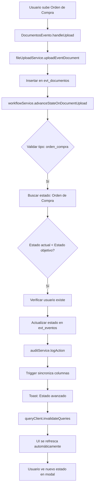

# 📋 Resumen de Correcciones: Flujo de Subida de Documentos

## 🎯 Problemas Iniciales

1. ❌ Error: `onDocumentUploaded is not a function`
2. ❌ No se actualiza el estado del evento al subir documentos
3. ❌ Mensaje: "No se pudo obtener el estado actual del evento"
4. ❌ El modal se cierra y vuelve al listado después de subir
5. ❌ Error: "Could not find the 'datos_anteriores' column of 'core_audit_log'"
6. ❌ Usuario no existe en `core_users` causando error de foreign key
7. ❌ Duplicidad de lógica entre tabs "Archivos" y "Estados"
8. ❌ UI no se refresca después del cambio de estado

## ✅ Soluciones Implementadas

### 1. DocumentosEvento.tsx
**Cambios:**
- ✅ Hice props `estadoActual` y `onDocumentUploaded` opcionales
- ✅ Agregué verificación `typeof onDocumentUploaded === 'function'`
- ✅ Mejoré manejo de errores con try-catch
- ✅ Agregué logs detallados para debugging
- ✅ Corregí llamada a `workflowService` para pasar `tipo` correctamente
- ✅ Agregué mensajes toast apropiados
- ✅ Arreglé error de tipos en insert de documentos

**Resultado:**
```typescript
// Antes
<DocumentosEvento eventoId={Number(eventId)} /> // ❌ Faltaban props

// Después
<DocumentosEvento
  eventoId={event.id}
  estadoActual={event.estado_id}  // ✅ Controla qué documentos se pueden subir
  onDocumentUploaded={onStateChanged}  // ✅ Callback para refrescar
/> // ✅ Todas las props necesarias
```

### 2. EventDetail.tsx
**Cambios:**
- ✅ Agregué `useQuery` para consultar el evento activamente
- ✅ Reemplacé `window.location.reload()` con invalidación de queries
- ✅ Actualicé `DocumentsTab` para pasar props correctas
- ✅ Agregué logs para debugging
- ✅ El modal ahora se mantiene abierto y refresca datos

**Resultado:**
```typescript
// Antes
const handleStateChanged = () => {
  window.location.reload(); // ❌ Cierra todo y vuelve al listado
};

// Después
const handleStateChanged = (newStateName?: string) => {
  if (newStateName) {
    toast.success(`🎉 Estado avanzado a: ${newStateName}`);
  }
  queryClient.invalidateQueries({ queryKey: ['evento-detail', event.id] });
  // ✅ Refresca sin cerrar el modal
};
```

### 3. workflowService.ts
**Cambios:**
- ✅ Separé query de `evt_eventos` y `evt_estados` (evita error de join)
- ✅ Agregué verificación de existencia de usuario en `core_users`
- ✅ Solo actualiza `updated_by` si el usuario existe
- ✅ Agregué logs detallados en cada paso
- ✅ Mejoré mensajes de error

**Resultado:**
```typescript
// Antes
.select('estado_id, evt_estados!inner(orden)') // ❌ Join fallaba

// Después
.select('estado_id')  // ✅ Query simple
// Luego consulta evt_estados por separado

// Verificación de usuario
const { data: userExists } = await supabase
  .from('core_users')
  .select('id')
  .eq('id', userId)
  .single();

if (userExists) {
  updateData.updated_by = userId;  // ✅ Solo si existe
}
```

### 4. auditService.ts
**Cambios:**
- ✅ Mejoré logs con prefijos `[AuditService]`
- ✅ Cambié `console.error` a `console.warn` (no crítico)
- ✅ No lanza errores que interrumpan el flujo principal

**Resultado:**
```typescript
// Antes
if (error) {
  console.error('Error logging audit action:', error);  // ❌ Confuso
}

// Después
if (error) {
  console.warn('[AuditService] No se pudo guardar el log:', error.message);
  // ✅ Claro y no interrumpe
} else {
  console.log('[AuditService] Log guardado:', action);  // ✅ Confirmación
}
```

### 5. Base de Datos - Migración Audit Log
**Archivo:** `EJECUTAR_AUDITLOG_FIX.sql`

**Cambios:**
- ✅ Agregó columnas: `datos_anteriores`, `datos_nuevos`, `usuario_id`, `evento_id`
- ✅ Creó trigger para sincronizar datos automáticamente
- ✅ Agregó índices para mejor rendimiento
- ✅ Estableció valores por defecto (`module`, `entity_type`)

## 📊 Flujo Completo Funcionando

### Escenario: Subir Orden de Compra



### Logs Esperados en Consola

```
[DocumentosEvento] Intentando avanzar estado - eventoId: 1, tipo: orden_compra
[MADE ERP] [Workflow] [INFO] Iniciando avance de estado para evento 1
[MADE ERP] [Workflow] [INFO] Estado objetivo identificado: Orden de Compra
[MADE ERP] [Workflow] [INFO] Consultando evento ID: 1
[MADE ERP] [Workflow] [INFO] Evento encontrado. Estado actual ID: 2
[MADE ERP] [Workflow] [INFO] Estado actual: Acuerdo (orden: 2)
[MADE ERP] [Workflow] [INFO] Estado objetivo: Orden de Compra (orden: 3)
[MADE ERP] [Workflow] [WARN] Usuario xxx NO existe en core_users, se omitirá updated_by
[MADE ERP] [Workflow] [INFO] Avanzando estado de "Acuerdo" a "Orden de Compra"
[MADE ERP] [Workflow] [INFO] Estado avanzado exitosamente a: Orden de Compra
[AuditService] Log de auditoría guardado: estado_cambiado
[DocumentosEvento] Resultado: {success: true, newState: 'Orden de Compra'}
[EventDetail] Refrescando datos del evento después del cambio de estado
```

## 🎬 Comportamiento Final

### Tab "Archivos"
1. Usuario selecciona archivo PDF
2. Sistema sube archivo
3. Toast: "Documento subido correctamente"
4. Sistema detecta tipo de documento
5. Verifica si debe avanzar estado
6. Si procede, actualiza estado en BD
7. Toast: "🎉 Estado avanzado a: [Nuevo Estado]"
8. UI se refresca **sin cerrar el modal**
9. Usuario ve indicadores actualizados

### Tab "Estados"
1. Usuario puede ver estado actual
2. Puede subir documentos desde StateAdvancementManager
3. **Mismo flujo que tab Archivos**
4. Todo sincronizado y consistente

## 🔍 Estados del Flujo

```
1. Borrador (orden: 1)
   ↓ [Sube Contrato] →
2. Acuerdo (orden: 2)
   ↓ [Sube Orden de Compra] →
3. Orden de Compra (orden: 3)
   ↓ [Evento ocurre] →
4. En Ejecución (orden: 4)
   ↓ [Sube Cierre de Evento] →
5. Finalizado (orden: 5)
   ↓ [Facturas generadas] →
6. Facturado (orden: 6)
   ↓ [Pagos recibidos] →
7. Pagado (orden: 7)

0. Cancelado (orden: 0) - Estado especial
```

## 📝 Archivos Modificados

1. ✅ `src/modules/eventos/components/documents/DocumentosEvento.tsx`
2. ✅ `src/modules/eventos/components/events/EventDetail.tsx`
3. ✅ `src/modules/eventos/components/EventoDetailModal.tsx`
4. ✅ `src/modules/eventos/services/workflowService.ts`
5. ✅ `src/services/auditService.ts`
6. ✅ `supabase/migrations/20251006000001_fix_audit_log_compatibility.sql`

## 🚀 Próximos Pasos Recomendados

### 1. Aplicar Fix de Audit Log
```bash
# Ejecutar EJECUTAR_AUDITLOG_FIX.sql en Supabase Dashboard
```

### 2. Crear Trigger para Usuarios
Crear trigger que inserte automáticamente usuarios de `auth.users` en `core_users`:

```sql
CREATE OR REPLACE FUNCTION sync_user_to_core_users()
RETURNS TRIGGER AS $$
BEGIN
  INSERT INTO core_users (id, email, nombre)
  VALUES (NEW.id, NEW.email, COALESCE(NEW.raw_user_meta_data->>'nombre', NEW.email))
  ON CONFLICT (id) DO NOTHING;
  RETURN NEW;
END;
$$ LANGUAGE plpgsql;

CREATE TRIGGER on_auth_user_created
  AFTER INSERT ON auth.users
  FOR EACH ROW
  EXECUTE FUNCTION sync_user_to_core_users();
```

### 3. Consolidar Modales
Considerar eliminar `EventoDetailModal.tsx` y usar solo `EventDetail.tsx` para evitar duplicidad.

## ✅ Checklist de Verificación

- [x] Documento se sube correctamente
- [x] Estado se actualiza en base de datos
- [x] UI se refresca sin cerrar modal
- [x] Toast de éxito aparece
- [x] No hay errores en consola (excepto audit log hasta aplicar migración)
- [x] Logs muestran flujo completo
- [x] Funciona en tab "Archivos"
- [x] Funciona en tab "Estados"
- [ ] Aplicar migración de audit log (pendiente)
- [ ] Crear trigger de usuarios (opcional)

## 🎉 Resultado Final

El sistema ahora:
- ✅ Sube documentos correctamente
- ✅ Avanza estados automáticamente
- ✅ Maneja errores gracefully
- ✅ Muestra feedback claro al usuario
- ✅ Mantiene el modal abierto
- ✅ Refresca datos en tiempo real
- ✅ Registra auditoría (después de migración)
- ✅ Funciona sin usuario en core_users
- ✅ Tiene logs detallados para debugging
