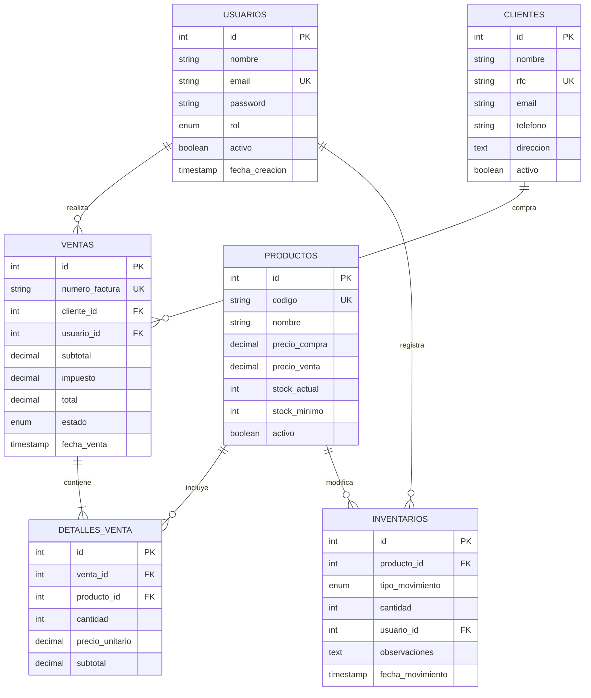

# filepath: diagrama-db.md
# Diagrama de Base de Datos

```mermaid
erDiagram
    USUARIOS ||--o{ VENTAS : realiza
    USUARIOS ||--o{ INVENTARIOS : registra
    CLIENTES ||--o{ VENTAS : compra
    VENTAS ||--|{ DETALLES_VENTA : contiene
    PRODUCTOS ||--o{ DETALLES_VENTA : incluye
    PRODUCTOS ||--o{ INVENTARIOS : modifica

    USUARIOS {
        int id PK
        string nombre
        string email UK
        string password
        enum rol
        boolean activo
        timestamp fecha_creacion
    }

    CLIENTES {
        int id PK
        string nombre
        string rfc UK
        string email
        string telefono
        text direccion
        boolean activo
    }

    PRODUCTOS {
        int id PK
        string codigo UK
        string nombre
        decimal precio_compra
        decimal precio_venta
        int stock_actual
        int stock_minimo
        boolean activo
    }

    VENTAS {
        int id PK
        string numero_factura UK
        int cliente_id FK
        int usuario_id FK
        decimal subtotal
        decimal impuesto
        decimal total
        enum estado
        timestamp fecha_venta
    }

    DETALLES_VENTA {
        int id PK
        int venta_id FK
        int producto_id FK
        int cantidad
        decimal precio_unitario
        decimal subtotal
    }

    INVENTARIOS {
        int id PK
        int producto_id FK
        enum tipo_movimiento
        int cantidad
        int usuario_id FK
        text observaciones
        timestamp fecha_movimiento
    }
```
